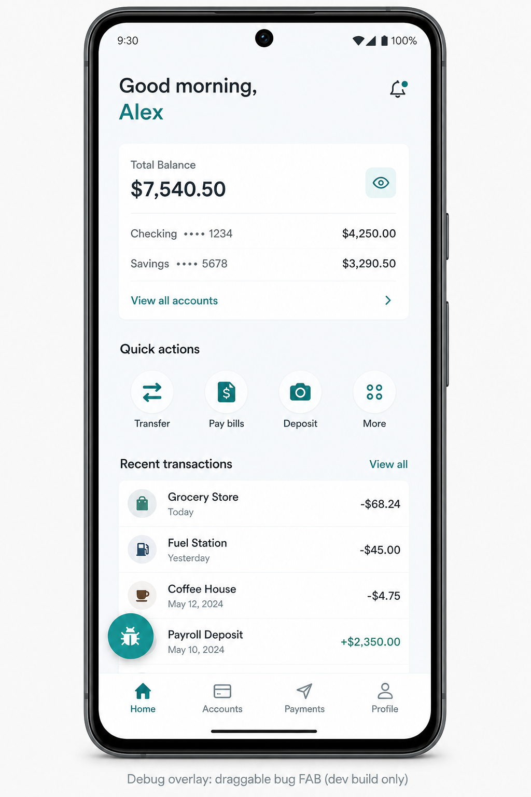
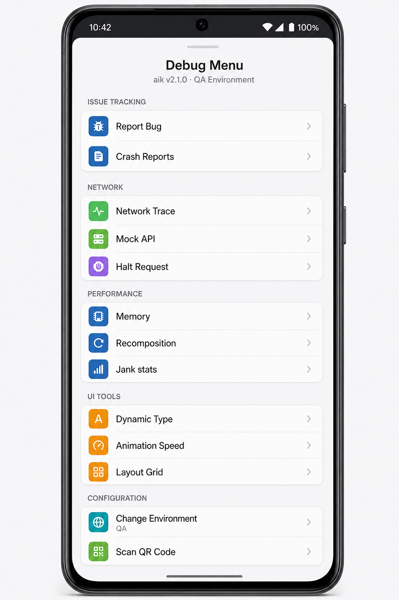
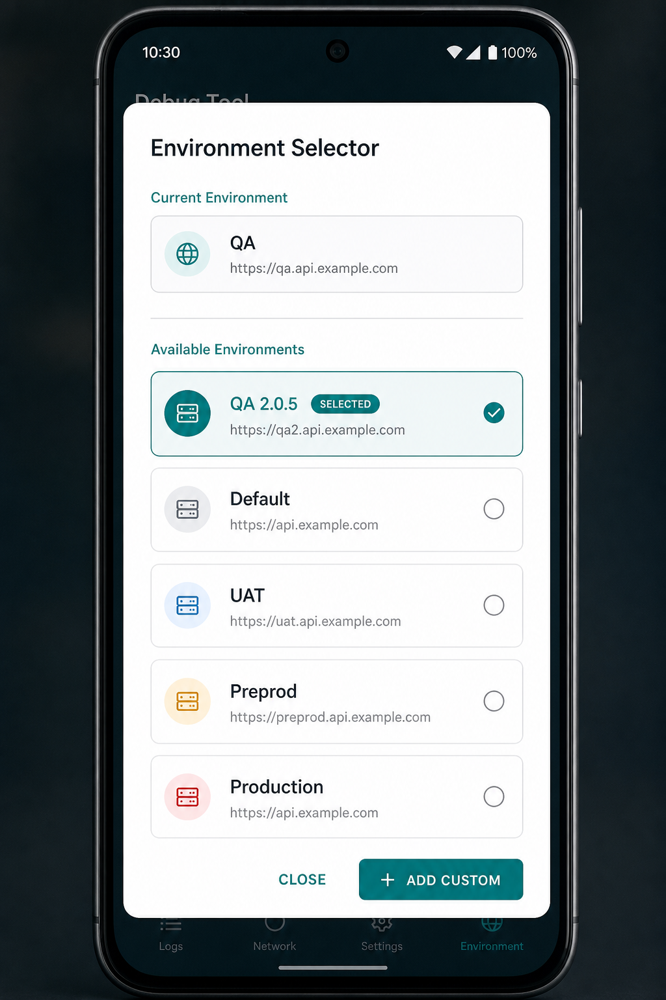
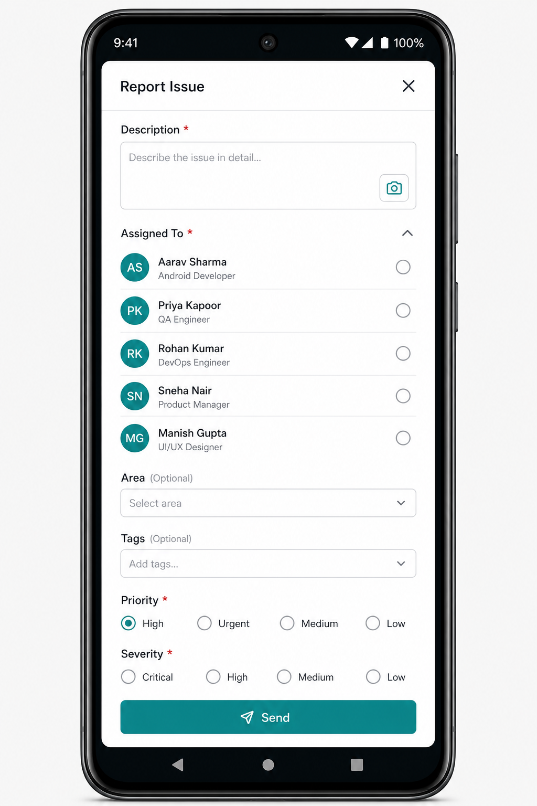

<p align="center">
  
  
  
  
</p>

<h1 align="center">debugTool</h1>

<p align="center">
  <strong>Drop-in Android debug menu</strong> for QA & engineering — environments, network tools,<br />
  Azure bug reports, UI simulators, and more. Ships only in <code>debug</code> builds.
</p>

<p align="center">
  <a href="#-quick-start-5-steps">Quick start</a> ·
  <a href="#-what-you-get">Features</a> ·
  <a href="#-screenshots">Screenshots</a> ·
  <a href="#-api-reference">API</a> ·
  <a href="#-troubleshooting">Troubleshooting</a>
</p>

---

## Why debugTool?

Integrating should take **under 30 minutes**. Your app only needs:

| Step | What you write |
|------|----------------|
| 1 | Gradle deps (`hooks` + `debugtool`) |
| 2 | `DebugToolHost` implementation |
| 3 | `DebugTool.install(...)` in `Application` |
| 4 | One `DebugToolScaffold { … }` wrapper |
| 5 | One OkHttp line: `addDebugToolInterceptors` |

No bridge packages in `:common` / `:data`. No copying FAB or menu UI from the sample.

---

## Screenshots

<p align="center">
  
  &nbsp;
  
</p>

<p align="center">
  <em>Floating bug FAB → full Debug Menu (drag to reposition)</em>
</p>

<p align="center">
  
  &nbsp;
  
</p>

<p align="center">
  <em>Environment switcher · Azure Report Issue (assignees from your host)</em>
</p>

---

## What you get

| | Feature | Description |
|---|---------|-------------|
| 🐞 | **Report Bug** | File Azure DevOps work items with screenshot + assignees |
| 📡 | **Network Trace** | Chucker inspector for requests / responses |
| ✋ | **Halt & Edit API** | Intercept, edit, or block traffic live |
| 🎭 | **Response Mocker** | Serve canned JSON without a backend |
| ⚡ | **API Performance** | Per-request timing & speed stats |
| 🌍 | **Change Environment** | Switch Dev / QA / UAT / Prod (or custom URLs) |
| 📷 | **QR Inspector** | Scan or paste payment / config QR payloads |
| 🧱 | **UI Tools** | Dynamic type, animation speed, layout grid, screen size |
| 📍 | **Location Spoofer** | Mock GPS for map & geofence flows |
| 💥 | **Crash / Logcat** | On-device crash history & local logs |
| 🧠 | **Perf stats** | Memory, Compose recomposition, jank frames |

---

## Architecture (two artifacts)

```text
┌─────────────────────────────────────────────────────────┐
│  Your app (:app)                                        │
│   debugImplementation → debugtool   (full UI + tools)   │
│   implementation      → debugtool-hooks (always safe)   │
├─────────────────────────────────────────────────────────┤
│  :common / :data / :presentation                        │
│   implementation → debugtool-hooks only                 │
│   (DebugToolHooks, OkHttp helper — no-op on release)    │
└─────────────────────────────────────────────────────────┘
```

| Artifact | Gradle | On release? |
|----------|--------|-------------|
| [`debugtool-hooks`](https://jitpack.io/#farooqkhandev/debugTool) | `implementation(...)` | ✅ Yes — tiny no-ops |
| [`debugtool`](https://jitpack.io/#farooqkhandev/debugTool) | `debugImplementation(...)` | ❌ Never |

**Coordinates**

```text
com.github.farooqkhandev:debugtool-hooks:1.0.3
com.github.farooqkhandev:debugtool:1.0.3
```

---

## Quick start (5 steps)

### 1) Add JitPack + dependencies

`settings.gradle.kts`:

```kotlin
dependencyResolutionManagement {
    repositories {
        google()
        mavenCentral()
        maven(url = "https://jitpack.io")
    }
}
```

`app/build.gradle.kts` (or the module that hosts UI + install):

```kotlin
dependencies {
    // All build types — Host APIs + runtime hooks (no-op without full lib)
    implementation("com.github.farooqkhandev:debugtool-hooks:1.0.3")

    // Debug builds only — FAB, menu, Chucker, Azure, overlays
    debugImplementation("com.github.farooqkhandev:debugtool:1.0.3")
}
```

> Shared modules (`:common`, `:data`) may depend on **hooks only**. Never add full `debugtool` there.

---

### 2) Implement `DebugToolHost`

This is the **only** required host-specific contract:

```kotlin
class MyDebugToolHost(
    private val prefs: SharedPreferences,
) : DebugToolHost {

    override fun environments() = listOf(
        DebugEnvironment(title = "Dev", url = "https://dev.example.com/api/"),
        DebugEnvironment(title = "QA", url = "https://qa.example.com/api/"),
        DebugEnvironment(title = "UAT", url = "https://uat.example.com/api/"),
    )

    override suspend fun currentEnvironment(): String =
        prefs.getString("env_url", environments().first().url).orEmpty()

    override suspend fun applyEnvironment(url: String) {
        prefs.edit().putString("env_url", url).apply()
        // Rebuild / swap your Retrofit base URL if needed
    }

    override fun appVersionName(): String = BuildConfig.VERSION_NAME
    override fun flavorName(): String = BuildConfig.FLAVOR
    override fun deviceId(): String = /* stable device id */

    override fun isEncryptionEnabled(context: Context): Boolean =
        prefs.getBoolean("enc", true)

    override suspend fun setEncryptionEnabled(context: Context, enabled: Boolean) {
        prefs.edit().putBoolean("enc", enabled).apply()
    }

    // Shown in Report Issue → Assigned To
    override fun assignees() = listOf(
        AssignedTo(name = "Farooq Khan", emailAddress = "farooq.khan@example.com"),
        AssignedTo(name = "QA Lead", emailAddress = "qa@example.com"),
    )
}
```

**Imports:** `com.quadlogixs.debugtool.api.*` (from `debugtool-hooks`).

---

### 3) Install in `Application` (debug only)

```kotlin
class MyApplication : Application() {
    override fun onCreate() {
        super.onCreate()
        if (BuildConfig.DEBUG) {
            DebugTool.install(
                application = this,
                config = DebugToolConfig(
                    host = MyDebugToolHost(prefs),
                    features = DebugFeatureFlags(
                        shakeEnabled = true,
                        chuckerEnabled = true,
                        mockApiPersistenceEnabled = true,
                    ),
                    azure = AzureDevOpsConfig(
                        organization = "your-org",
                        project = "your-project",
                        areaPath = "your-project\\Android Bug",
                        patProvider = AzurePatProvider {
                            System.getenv("AZURE_DEVOPS_PAT").orEmpty()
                        },
                    ),
                    azureLabel = "your-project/debugTool",
                ),
            )
        }
    }
}
```

Prefer putting install in `src/debug` so release never references `DebugTool` at all.

Set a PAT for bug reports (never hardcode in source):

```bash
# Windows
set AZURE_DEVOPS_PAT=your_token_here

# macOS / Linux
export AZURE_DEVOPS_PAT=your_token_here
```

---

### 4) Wrap your Compose root with `DebugToolScaffold`

```kotlin
@AndroidEntryPoint
class MainActivity : ComponentActivity() {
    override fun onCreate(savedInstanceState: Bundle?) {
        super.onCreate(savedInstanceState)
        setContent {
            YourAppTheme {
                // Requires @AndroidEntryPoint activity (Hilt ViewModels in dialogs)
                DebugToolScaffold {
                    YourAppNavHost()
                }
            }
        }
    }
}
```

`DebugToolScaffold` includes:

- Always-visible **draggable bug FAB**
- Full **Debug Menu** + feature dialogs
- Layout grid / screen-size simulator overlays
- Halt-API dialog host

Optional: `revealMode = DebugToolRevealMode.AlwaysVisibleFab` (default).

---

### 5) Wire OkHttp

```kotlin
import com.quadlogixs.debugtool.hooks.DebugToolNetwork.addDebugToolInterceptors

val client = OkHttpClient.Builder()
    .addDebugToolInterceptors(context)
    .build()
```

When the full library is installed, interceptors run in order:

**Mock → Halt → Chucker → Api Speed**

On release (hooks only): **no-op** — safe to call from shared `:data` networking.

---

## Use hooks from any module

`:common` / `:presentation` can read debug state **without** depending on the full library:

```kotlin
import com.quadlogixs.debugtool.hooks.DebugToolHooks
import com.quadlogixs.debugtool.hooks.rememberDebugDynamicTypeScale

// Compose
val typeScale = rememberDebugDynamicTypeScale()

// Imperative
val duration = DebugToolHooks.navAnimationDurationMillis(baseMs = 300)
val mockGps = DebugToolHooks.mockLocation() // Pair<lat, lng>? or null
val hideLoader = DebugToolHooks.isLoaderSuppressed()
val halted = DebugToolHooks.isApiHalted()
```

| API | Default (no full lib) |
|-----|------------------------|
| `typographyScale` / `rememberDebugDynamicTypeScale()` | `1f` |
| `navAnimationDurationMillis(base)` | `base` unchanged |
| `mockLocation()` | `null` |
| `isLoaderSuppressed()` / `isApiHalted()` | `false` |

---

## Module dependency rules

```text
✅ :app          → implementation(hooks) + debugImplementation(debugtool)
✅ :common       → implementation(hooks)
✅ :data         → implementation(hooks)  // for addDebugToolInterceptors
❌ :common/:data → debugtool              // never
❌ release APK   → full debugtool classes // use debugImplementation
```

---

## Project layout (this repo)

| Module | Role |
|--------|------|
| `:debugtool-hooks` | Host / Config APIs, `DebugToolHooks`, `DebugToolNetwork` |
| `:debugtool` | Full UI (`DebugToolScaffold`), Chucker, Azure, install |
| `:app` | Sample — debug uses Scaffold; release is hooks-only |

Try the sample:

1. Open the project in Android Studio  
2. Run `:app` (debug)  
3. Tap the floating bug icon  

---

## Publish (maintainers)

```bash
./gradlew :debugtool-hooks:publishToMavenLocal :debugtool:publishToMavenLocal
```

Tag `1.0.3` on GitHub → [JitPack](https://jitpack.io/#farooqkhandev/debugTool) green → consume coordinates above.

---

## Troubleshooting

| Problem | Fix |
|---------|-----|
| ❓ Dependency not found | Wait for JitPack build, or use `mavenLocal()` after `publishToMavenLocal` |
| 🐞 No bug icon | Debug build + `DebugTool.install` + `DebugToolScaffold` + `@AndroidEntryPoint` activity |
| 📡 Chucker / mock / halt missing | Call `addDebugToolInterceptors(context)` on your OkHttp builder |
| 🔤 Dynamic type unused | Read `rememberDebugDynamicTypeScale()` / `DebugToolHooks.typographyScale` |
| 👥 Only one assignee | Implement `DebugToolHost.assignees()` with the full team list |
| 🎫 Bug report fails | Set `AZURE_DEVOPS_PAT` + valid org / project / area path |
| 💥 Duplicate Chucker classes | Do not mix `library` + `library-no-op` on the same classpath |

---

## License

Apache License 2.0 — see repository for details.

<p align="center">
  <sub>Built for debug builds · Safe for release via <code>debugtool-hooks</code></sub>
</p>
